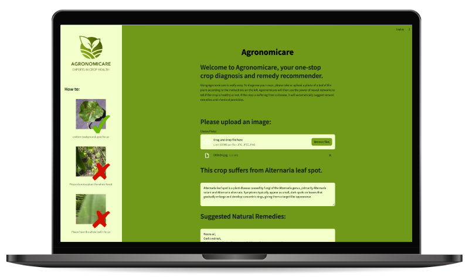

# Crop disease prediction and pesticide/ natural remedies recommendation


*Mockup designed by Rawpixel.com / Freepik*

## Overview

This repository contains code for a crop disease prediction and remedies recommendation system. The crop disease prediction and remediation system plays a crucial role in modern agriculture by providing farmers with proactive tools to manage and safeguard their crops effectively. By accurately predicting the likelihood of crop diseases, the system empowers farmers to take preemptive measures, thereby reducing the risk of yield loss and economic damage. Additionally, the recommendation of appropriate remedies, whether pesticide-based or natural, enables farmers to make informed decisions that balance effectiveness with environmental sustainability. Ultimately, this system not only helps optimize crop yields but also contributes to the sustainable and responsible management of agricultural resources, ensuring food security for communities worldwide.
#

*This project serves as the capstone project for the Data Science Bootcamp by [neuefische](https://www.neuefische.de/). Team members are: [FreyaStein](https://github.com/FreyaStein), [forster-j](https://github.com/forster-j), [olugbengaoloyade](https://github.com/olugbengaoloyade) and [Ankit-kumar91](https://github.com/Ankit-kumar91).*

## About the Dataset
The training dataset *Plant Diseases Training Dataset* can be found on [Kaggle](https://www.kaggle.com/datasets/nirmalsankalana/plant-diseases-training-dataset/data). This dataset contains a collection of images of various crop leaves affected by different diseases. It contains 95868 images and 38 disease types.
> Total Images: 95868

> Classes: 38 (e.g., 'Apple___Apple_scab', 'Apple___Black_rot', 'Grape___Black_rot', etc.) 


## Repository Structure

* functions: Contains functions for plotting and preprocessing the data
* images: Images needed for the app
* models: Trained model needed for the app
* notebooks: Notebooks the explain loading, EDA, feature engineering and training.
* util.py: Contains helper scripts for the streamlit app.

## Getting Started

Clone this repository.
Set up a Python environment and install the necessary dependencies listed in requirements.txt.
Utilize the provided scripts in the src directory for model training, data preprocessing, etc.

## Set up your Environment

### **`macOS`** type the following commands : 

- For installing the virtual environment you can either use the [Makefile](Makefile) and run `make setup` or install it manually with the following commands:

     ```BASH
    make setup
    ```
    After that active your environment by following commands:
    ```BASH
    source .venv/bin/activate
    ```
Or ....
- Install the virtual environment and the required packages by following commands:

    ```BASH
    pyenv local 3.11.3
    python -m venv .venv
    source .venv/bin/activate
    pip install --upgrade pip
    pip install -r requirements.txt
    ```
    
### **`WindowsOS`** type the following commands :

- Install the virtual environment and the required packages by following commands.

   For `PowerShell` CLI :

    ```PowerShell
    pyenv local 3.11.3
    python -m venv .venv
    .venv\Scripts\Activate.ps1
    pip install --upgrade pip
    pip install -r requirements.txt
    ```

    For `Git-bash` CLI :
  
    ```BASH
    pyenv local 3.11.3
    python -m venv .venv
    source .venv/Scripts/activate
    pip install --upgrade pip
    pip install -r requirements.txt
    ```

    **`Note:`**
    If you encounter an error when trying to run `pip install --upgrade pip`, try using the following command:
    ```Bash
    python.exe -m pip install --upgrade pip
    ```


   
## Usage

Run the app with the following command: `streamlit run main.py`